# System Architecture: World Money Terminal OS

## 1. System Overview

World Money combines institutional market data ingestion, quantitative analytics, and AML graph intelligence into a high-performance terminal workspace.

```mermaid
flowchart TB
    subgraph Data_Layer [Data Ingestion & Event Stream]
        direction TB
        WS[wsManager.js: High-Frequency WebSocket Engine]
        MDA[marketDataAggregator.js: Multi-Asset Router]
        FRED[macroLiquidityService.js: FRED & World Bank API]
        NEWS[newsService.js: Real-Time Event Aggregator]
    end

    subgraph Analytics_Layer [Quantitative & Risk Engines]
        direction TB
        Carry[fxCarryModel.js: Sovereign Spread Ranker]
        VaR[varRiskEngine.js: 95%/99% VaR & Stress Shocks]
        PnL[pnlAttribution.js: Spot + Carry + Fee Decomposition]
    end

    subgraph UI_Layer [Bloomberg Terminal Components]
        direction TB
        Ticker[LiveTickerRibbon: Marquee Ticker]
        Chart[RealTimeCandleChart: Canvas OHLCV + SMA20 + RSI14]
        OMS[OrderTicket: Paper Execution Desk]
        Blotter[PortfolioBlotter: Real-time Mark-to-Market]
        CmdK[CommandPalette: Cmd+K Function Router]
        Desk[TerminalWorkspace: Multi-Desk Presets]
    end

    subgraph Core_Vault [Financial Data Snapshot & AML]
        direction TB
        Graph[EntityGraph: 570+ Sovereign Nodes & Rails]
        Finder[ConnectionFinder: Shortest Path Routing]
        Dossier[CorporateTreasuryIntelligence: Cash Piles]
    end

    WS -->|Pub/Sub 280ms Ticks| Ticker
    WS -->|Live Bar Push| Chart
    WS -->|Mark Price Feed| Blotter
    MDA -->|Normalized Contract| WS
    Carry -->|Yield Curves| Desk
    VaR -->|Risk Profile| Desk
    PnL -->|Attribution Matrix| Blotter
    OMS -->|Executed Orders| Blotter
    CmdK -.->|Function Navigation| Desk
    CmdK -.->|Route to AML| Finder
    NEWS -->|Entity Tags| Graph
```

---

## 2. Core Subsystems

### 2.1 Real-Time Market Data Engine (`src/services/`)
- **`marketDataAggregator.js`**: Standardizes tickers across FX, Commodities, Indices, and Crypto into a unified contract schema.
- **`wsManager.js`**: Provides a high-frequency WebSocket pub/sub bus. Generates realistic stochastic micro-drift (Brownian motion) at sub-second frequency (<300ms) with unreffed timers for test cleanliness.
- **`newsService.js`**: Streams multi-source financial news with entity tagging and sentiment classification.

### 2.2 Quantitative & Risk Modeling (`src/analytics/`)
- **`fxCarryModel.js`**: Evaluates policy rate spreads $\Delta r = r_{\text{target}} - r_{\text{base}}$, implied volatility ratios, and projected 1-year leveraged yield.
- **`pnlAttribution.js`**: Decomposes mark-to-market trade returns into Spot Delta, Carry/Accrued Interest, and Transaction Costs.
- **`varRiskEngine.js`**: Computes 1-day and 10-day Value-at-Risk under 95% and 99% confidence horizons using parametric volatility weighting, alongside 4 stress scenario shock models.

### 2.3 Terminal UI & Trading Floor UX (`components/Terminal/`)
- **`TerminalWorkspace.jsx`**: Master grid manager offering 3 workspace layouts:
  1. *FX & Macro Trading Desk* (Candlestick Chart + Order Ticket + Blotter)
  2. *Risk & VaR Analytics* (VaR Engine + FX Carry Matrix + Mark-to-Market Blotter)
  3. *Live News & Event Stream* (Entity-tagged real-time market wires)
- **`LiveTickerRibbon.jsx`**: Top marquee bar with sub-second visual flash animations on tick updates.
- **`RealTimeCandleChart.jsx`**: High-density SVG candle rendering with SMA 20 overlay and RSI 14 sub-panel.
- **`OrderTicket.jsx`**: Full paper trading OMS execution ticket with pre-trade margin and leverage validation.
- **`PortfolioBlotter.jsx`**: Live position ledger mark-to-market valuations and real-time margin tracking.
- **`CommandPalette.jsx`**: Bloomberg function keyboard overlay (`Cmd + K`).

---

## 3. Integration with World Money Core
- **Cross-View Routing**: `CommandPalette.jsx` routes seamlessly between the Trading Terminal, Macro Liquidity Monitor, and MoneyTrace AML.
- **Entity Linking**: Entity pills in the News Feed (`#BLACKROCK-US`, `#JIO-IN`, `#FED`) link directly into the **Financial Relationship Graph** and **Multi-Hop Connection Finder**.
